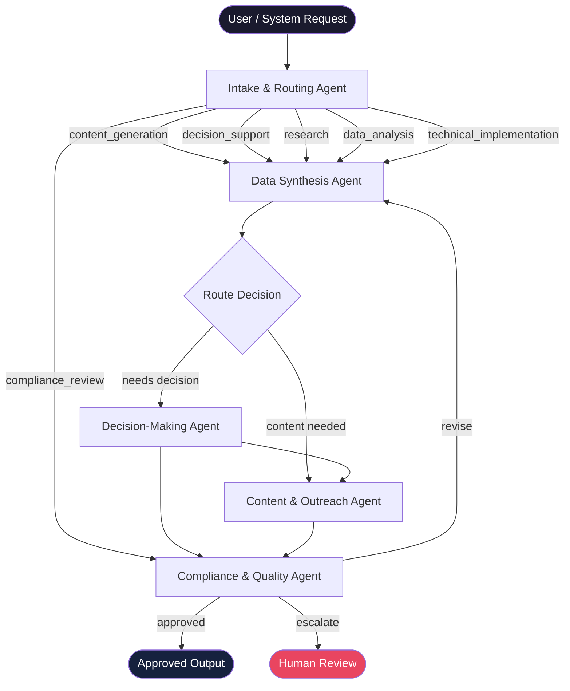

# Five-Agent Operating System

[](https://github.com/donny-devops/five-agent-os/actions/workflows/ci.yml)
[](https://www.python.org/downloads/)
[](LICENSE)
[](https://github.com/astral-sh/ruff)

A practical multi-agent operating model for intake, synthesis, decisions, outreach, and quality control.

Built for service businesses, consulting workflows, internal ops, sales enablement, digital marketing, IT/cloud operations, and AI automation pipelines.

---

## Agent Lineup

| Agent | Primary Job | Output |
|---|---|---|
| Intake & Routing Agent | Capture request, classify work, assign priority, route to the right agent path | `TaskPacket` |
| Data Synthesis Agent | Convert messy inputs into structured facts, insights, risks, and source notes | `SynthesisBrief` |
| Decision-Making Agent | Compare options, score tradeoffs, choose next action, document rationale | `DecisionRecord` |
| Content & Outreach Agent | Produce customer-facing or internal content based on approved context | `ContentPackage` |
| Compliance & Quality Agent | Validate accuracy, policy, privacy, security, completeness, and delivery readiness | `QualityGateReport` |

---

## Architecture



---

## Fast Start

**Requirements:** Python 3.11+

```bash
# 1. Clone
git clone https://github.com/donny-devops/five-agent-os.git
cd five-agent-os

# 2. Create and activate a virtual environment
python -m venv .venv
source .venv/bin/activate        # Windows: .venv\Scripts\activate

# 3. Install dev dependencies
pip install ruff pytest

# 4. Run the workflow with the default sample request
python -m src.multi_agent_os.orchestrator

# 5. Or pass your own request
python -m src.multi_agent_os.orchestrator \
  --request "Write a LinkedIn post summarizing our Q2 product launches"
```

**Sample output (truncated):**
```json
{
  "task_packet": {
    "request_id": "REQ-4A2F1C9B8E3D",
    "work_type": ["content_generation"],
    "route": ["data_synthesis_agent", "content_outreach_agent", "compliance_quality_agent"],
    "version": "1.1.0"
  },
  "agent_outputs": [
    { "agent_name": "data_synthesis_agent", "status": "success", "duration_ms": 0.42 },
    { "agent_name": "content_outreach_agent", "status": "success", "duration_ms": 0.31 },
    { "agent_name": "compliance_quality_agent", "status": "success", "duration_ms": 0.28 }
  ]
}
```

---

## Running Tests

```bash
pytest tests/ -v
```

| Test file | Coverage |
|---|---|
| `tests/test_models.py` | `TaskPacket`, `AgentOutput`, `generate_request_id` |
| `tests/test_router.py` | `detect_work_types`, `detect_risk`, `build_route`, `create_task_packet` |
| `tests/test_orchestrator.py` | All 4 agent functions + full `run_workflow` integration |

---

## Project Structure

```
five-agent-os/
├── .github/workflows/ci.yml       # CI: ruff + pytest on Python 3.11/3.12
├── agents/                         # Agent markdown specs
├── config/agents.yaml              # Agent configuration
├── docs/                           # Handoff protocol + operating playbook
├── examples/                       # Sample task packets
├── schemas/                        # JSON schemas for TaskPacket + AgentOutput
├── src/multi_agent_os/
│   ├── models.py                   # TaskPacket, AgentOutput dataclasses
│   ├── router.py                   # Keyword router with confidence scoring
│   └── orchestrator.py             # Async pipeline runner with retry + logging
├── tests/                          # pytest test suite
├── CHANGELOG.md
├── CONTRIBUTING.md
└── pyproject.toml
```

---

## Key Features (v1.1.0)

- **UUID-based request IDs** — every workflow run gets a unique `REQ-{uuid}` identifier
- **Confidence-scored routing** — `RouteResult.confidence_score` (0.0–1.0) flags hard vs. soft routes
- **Async pipeline** — `run_workflow_async()` backed by `asyncio`; ready for concurrent agent execution
- **Retry decorator** — exponential back-off on transient failures (3 attempts, 0.5s base delay)
- **Structured JSON logging** — every agent emit contains `request_id`, `agent`, `status`, `duration_ms`
- **Schema versioning** — `SCHEMA_VERSION` stamped on every `TaskPacket`
- **53 unit + integration tests** across models, router, and orchestrator

---

## Production Hardening Checklist

- [ ] Replace keyword router with a model-based classifier (`confidence_score < 0.8` routes should escalate)
- [ ] Swap `asyncio.get_event_loop().run_in_executor` for a proper `asyncio.TaskGroup` when agents can run concurrently
- [ ] Add OpenTelemetry spans around `_timed_agent()`
- [ ] Connect `AgentOutput` to a persistent store (Postgres, S3, etc.) keyed by `request_id`
- [ ] Add a dead-letter queue for agents that exceed `max_attempts` in the retry decorator

---

## Contributing

See [CONTRIBUTING.md](CONTRIBUTING.md) for the sixth-agent guide, handoff contract format, schema extension rules, and commit style.
