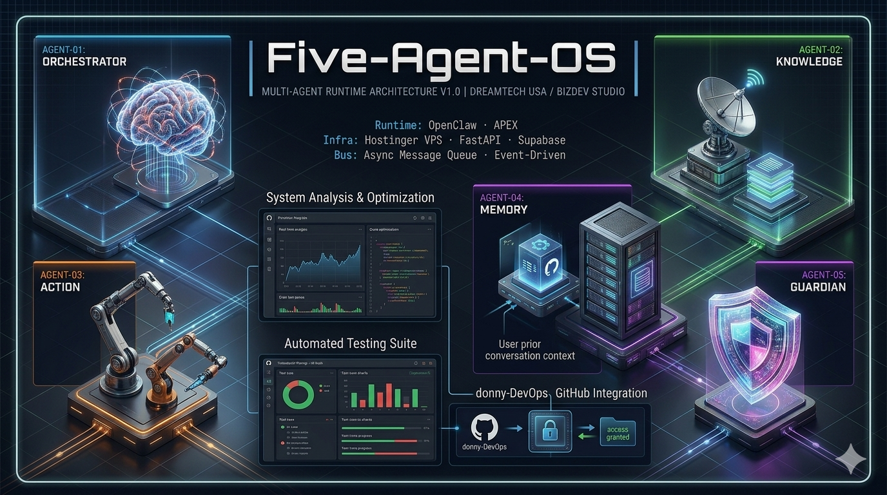

# Project Media

  

## Five-Agent-OS Architecture Visual

This media asset presents the Five-Agent-OS runtime model as a multi-agent operating architecture with dedicated lanes for orchestration, knowledge, action, memory, and guardian controls.

## LinkedIn Caption

Building something bigger than a chatbot.

**Five-Agent-OS** is a modular multi-agent runtime architecture engineered for orchestration, autonomous action pipelines, contextual memory, knowledge retrieval, and security governance.

Traditional AI systems respond. Agentic systems collaborate.

## Suggested Tags

`#AgenticAI` `#MultiAgentSystems` `#DevOps` `#DevSecOps` `#MLOps` `#Automation` `#FastAPI` `#Supabase` `#CyberSecurity` `#GitHub` `#CloudComputing`
